# Chap 9. 면접 문제

본격적으로 문제를 풀 수 있는 단원입니다.
단위 테스트 코드를 작성하여 푼 문제를 검증합니다.

## 단위 테스트 만들어서 실행하기

\* 작성자의 환경에 맞춰져 있으므로 모든 환경에서 작동됨을 보장하지 못합니다. '작성자는 이렇게 테스트를 했구나' 정도만 알아두시면 좋을 것 같습니다.
 
\* 이하 내용은 "자바와 JUnit을 활용한 실용주의 단위테스트"책의 제 1부 1장 "첫 번째 JUnit 테스트 만들기" 내용을 토대로 작성하였습니다.

- 환경: IntelliJ IDEA
- 언어: JAVA
- 라이브러리: JUnit

### 1. 프로젝트 생성
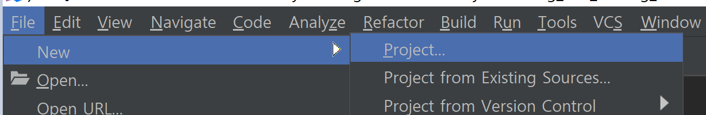

IntelliJ IDEA에서 File -> New -> Project 버튼을 눌러 새로운 프로젝트를 생성합니다.

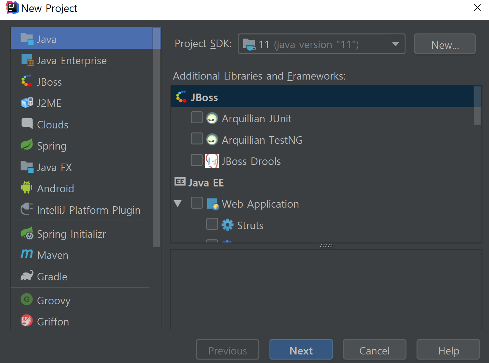

Next 버튼을 누르면서 원하는 프로젝트 환경 설정을 합니다.

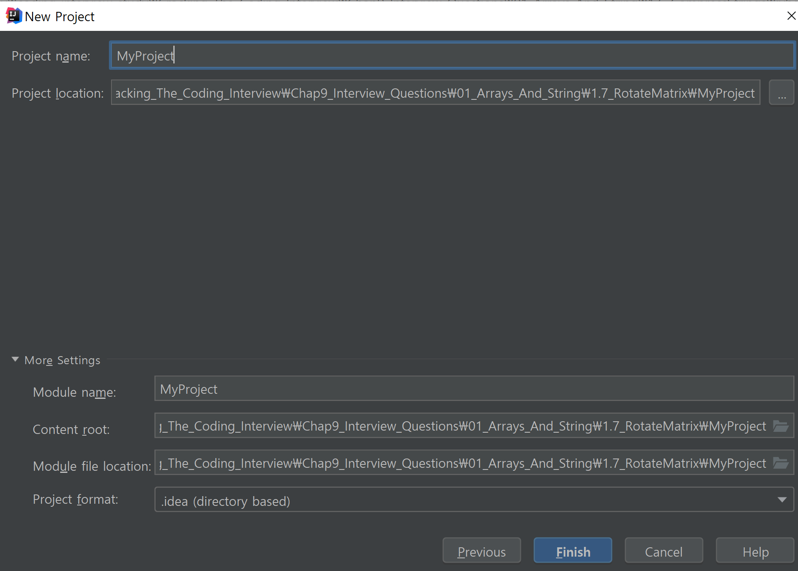

Finish 버튼을 눌러 프로젝트를 생성합니다.

### 2. 메소드 작성하기

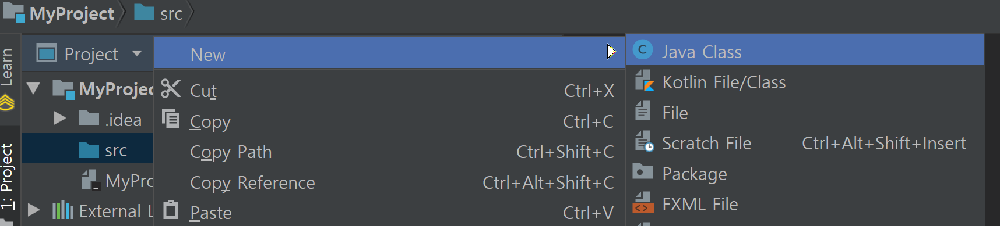

src 디렉토리 우클릭 -> New -> Java Class 를 눌러 코드를 작성할 파일을 만듭니다.

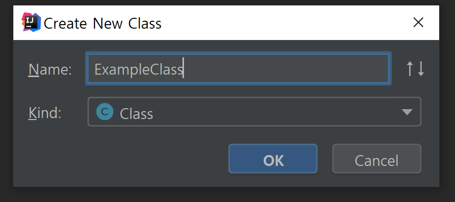

클래스를 생성합니다.

```Java
public class ExampleClass {
    static String printSameString(String string) {
        return "";  // 임시로 작성
    }
}
```

문제에 해당하는 메소드를 작성합니다.

### 3. 테스트 코드 작성

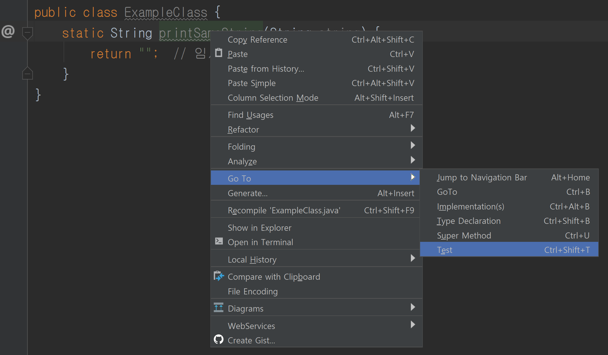

해당 메소드 우클릭 -> Go To -> Test 버튼을 누릅니다.

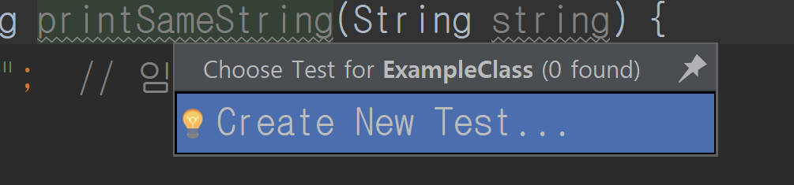

Create New Test... 버튼을 누릅니다.

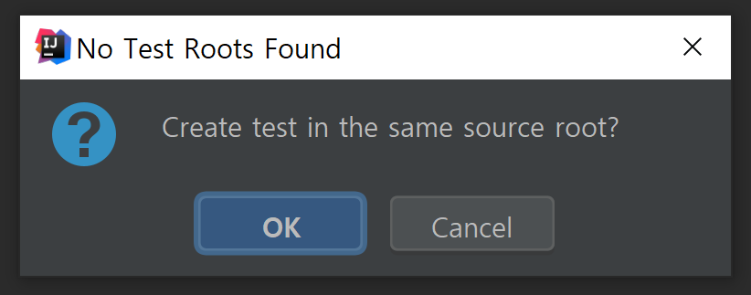

현재 만들어진 테스트가 없기 때문에 No Test Roots Found 알림창이 나옵니다.
OK 버튼을 눌러 테스트를 만듭니다.

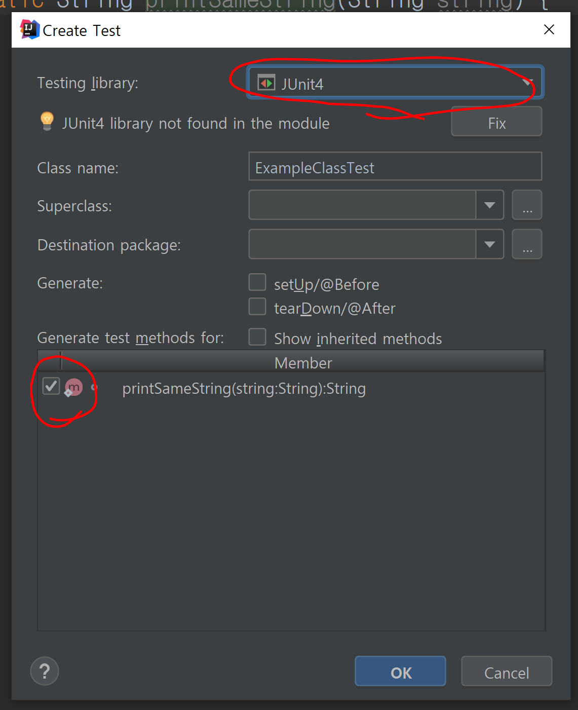

Testing Library를 JUnit4로 설정하고, 테스트를 만들고 싶은 메소드의 체크박스를 누르고 OK 버튼을 눌러 테스트를 작성합니다.

```Java
import static org.junit.Assert.*;

public class ExampleClassTest {

    @org.junit.Test
    public void printSameString() {
    }
}
```

다음과 같은 코드가 작성된 것을 볼 수 있습니다.


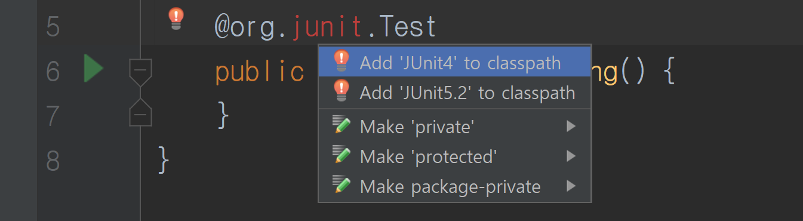

만약 작성된 코드에서 오류가 나온다면 Alt + Enter 단축키를 통해 JUnit4를 classpath에 추가합니다.

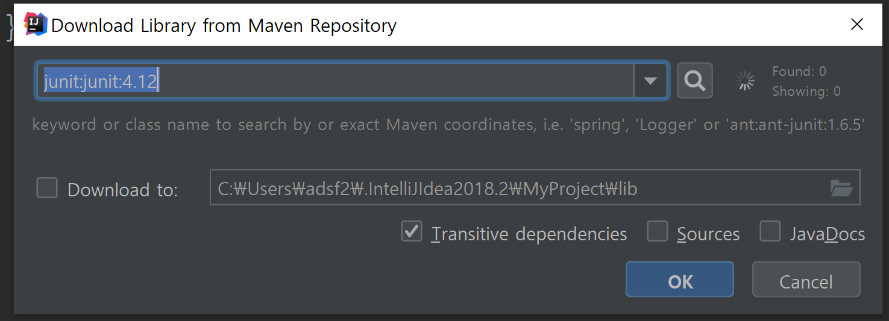

OK 버튼을 눌러 라이브러리를 Maven Repository에 추가합니다.

```Java
import static org.hamcrest.CoreMatchers.equalTo;
import static org.junit.Assert.*;

public class ExampleClassTest {

    @org.junit.Test
    public void printSameString() {
        String helloWorld = "hello, World!";
        assertThat(ExampleClass.printSameString(helloWorld), equalTo(helloWorld));
    }
}
```

테스트 코드를 작성합니다. equalTo 메소드를 사용하기 위해 CoreMatchers 를 import 할 필요가 있습니다.

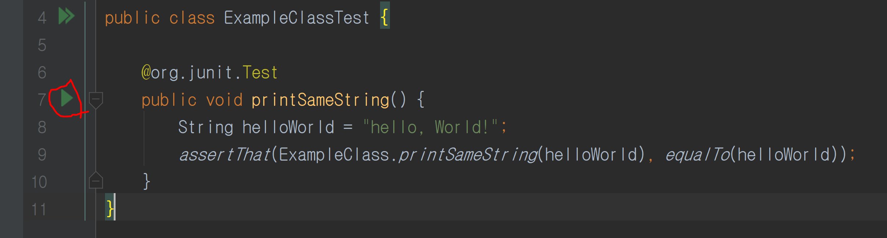

우측의 초록 실행버튼을 눌러 테스트를 실행합니다.

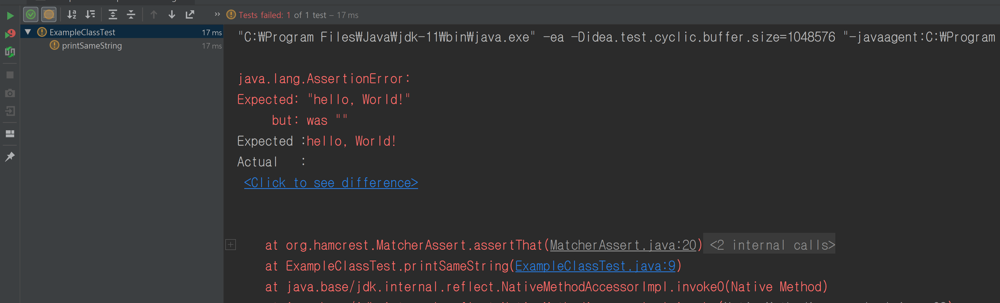

테스트 결과가 출력됩니다.

### 4. 테스트 주도 개발

테스트는 통과하지 못했습니다. 

```Java
public class ExampleClass {
    static String printSameString(String string) {
        return "hello, World!";  // 첫 번째 테스트만 통과
    }
}
```

코드를 수정하고 다시 테스트를 진행합니다.

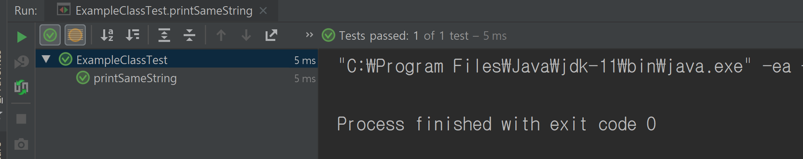

테스트가 통과됩니다.

```Java
    @org.junit.Test
    public void printSameString() {
        String helloWorld = "hello, World!";
        assertThat(ExampleClass.printSameString(helloWorld), equalTo(helloWorld));
        String printString = "printString"; // new test string
        assertThat(ExampleClass.printSameString(printString), equalTo(printString));
    }
```

새로운 테스트를 작성하고, 실행합니다.

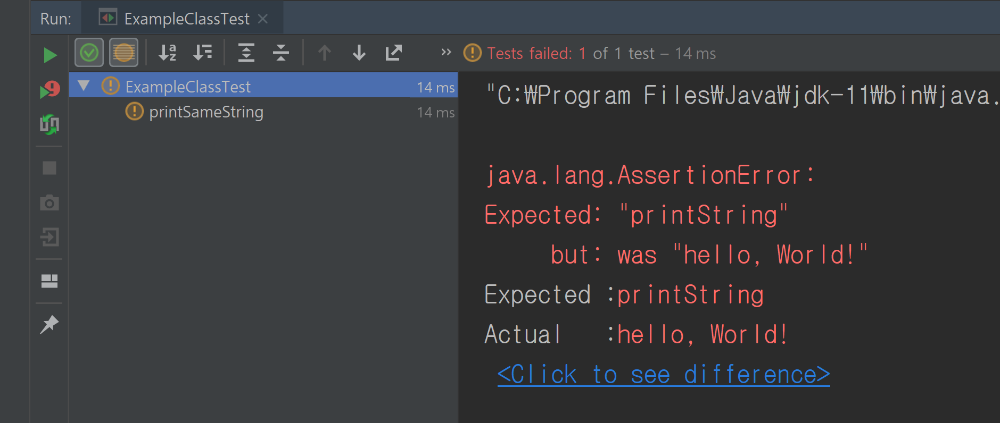

당연히 실패합니다.

```Java
public class ExampleClass {
    static String printSameString(String string) {
//        return "hello, World!";  // 첫 번째 테스트만 통과
        return string;  // 두 번째 테스트까지 통과
    }
}
```

테스트를 통과할 수 있도록 코드를 수정하고 다시 실행시킵니다.

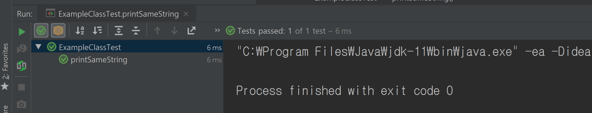

두 번째 테스트까지 통과했습니다.

```Java
import static org.hamcrest.CoreMatchers.equalTo;
import static org.junit.Assert.*;

public class ExampleClassTest {

    @org.junit.Test
    public void printSameString() {
        String helloWorld = "hello, World!";
        assertThat(ExampleClass.printSameString(helloWorld), equalTo(helloWorld));
        String printString = "printString"; // new test string
        assertThat(ExampleClass.printSameString(printString), equalTo(printString));
        String input3 = "input3"; // new test string
        assertThat(ExampleClass.printSameString(input3), equalTo(input3));
        String input4 = "asdfalivhlashvlashd lashfliadshlihasl h sdoihf oaishs dfoiasdfhoi sah"; // new test string
        assertThat(ExampleClass.printSameString(input4), equalTo(input4));
        String input5 = helloWorld + printString; // new test string
        assertThat(ExampleClass.printSameString(input5), equalTo(input5));
        String input6 = "6번째 테스트를 실행합니다!!!!!"; // new test string
        assertThat(ExampleClass.printSameString(input6), equalTo(input6));
    }
}
```

다양한 테스트를 더 만들어 통과가 되는지 확인합니다.

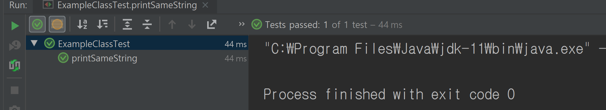

다양한 테스트가 통과됩니다.

이렇게 테스트 코드를 먼저 작성하고, 이 테스트를 통과하는 코드를 작성하는 개발 방법론을 테스트 주도 개발(TDD, Test Driven Development)이라고 합니다.